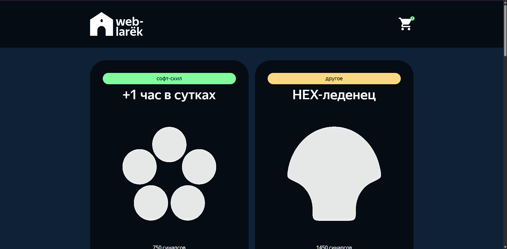
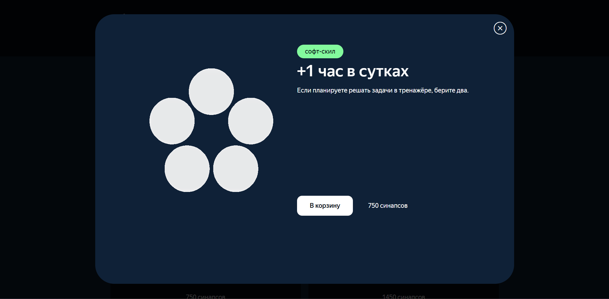

#  Веб-ларёк с товарами для программистов

## Структура проекта:
- src/ — исходные файлы проекта.
- src/components/ — папка с TS компонентами.
- src/components/base/ — папка с базовым кодом.

### Важные файлы:
- src/pages/index.html — HTML-файл главной страницы.
- src/types/index.ts — файл с типами.
- src/index.ts — точка входа приложения.
- src/scss/styles.scss — корневой файл стилей.
- src/utils/constants.ts — файл с константами.
- src/utils/utils.ts — файл с утилитами.

## Что сделала 
- Построила архитектуру проекта по паттерну MVP
- Реализовала слои: модель, представление, презентер
- Настроила взаимодействие между слоями и интерфейсом

## Реализованный функционал
- Каталог товаров с отображением карточек и их описаний
- Работа с моделями данных: загрузка и хранение товаров
- Динамическое обновление интерфейса при взаимодействии пользователя
- Базовая обработка событий: добавление товаров в корзину, удаление из корзины и т.д.

## Технологии
- HTML, SCSS, TS, Webpack
- Работа с API, Git

## Инструкция по запуску
Для запуска проекта нужно выполнить несколько шагов:
1. Создайте папку и перейдите в неё: 
`cd name_folder`
2. Склонируйте данный репозиторий: 
`git clone https://github.com/MilanaMur/web-larek-frontend.git`
3. Установите зависимости:
`npm install или yarn`
4. Запустите проект:
`npm run start или yarn start`

## Требования к запуску

- **Node.js**: >=18.0.0 **(рекомендуется LTS-версия)**
- **npm**: >=9.0.0

### Основные зависимости

- **TypeScript**: ^5.0.4
- **Webpack**: ^5.81.0
- **SCSS (Sass)**: ^1.62.1
- **PostCSS**: ^8.4.23 **+ Autoprefixer**